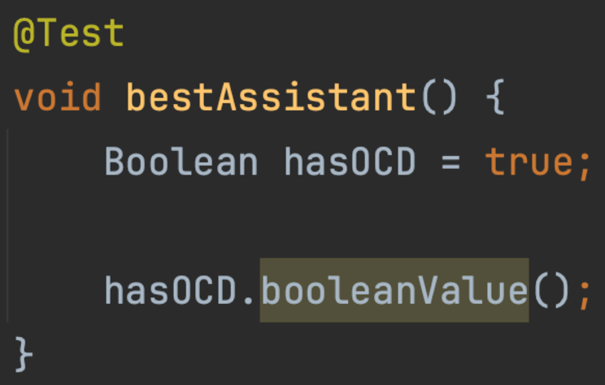
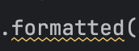
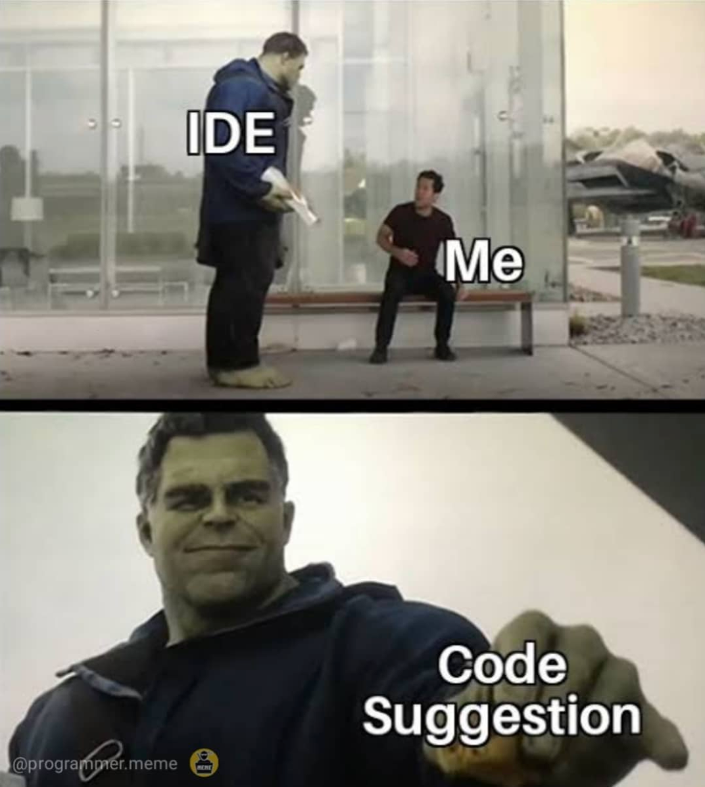

# Streams in Java

## Agenda

- Who am I?
- Introduction to streams and the domain
- Streams explained (+ debugging streams)
- Common pitfalls
- Practice makes perfect

## Tools

- [Iterm2](https://dev.to/abdfnx/oh-my-zsh-powerlevel10k-cool-terminal-1no0)
- [sdkman](https://sdkman.io/)
- [gradle 8.10 wrapper](https://gradle.org/)
- [java 21.0.4-tem](https://adoptium.net/temurin/releases/)
- [IntelliJ IDEA](https://www.jetbrains.com/idea/)
- [Learn and Teach](https://www.jetbrains.com/help/idea/product-educational-tools.html)
- [junit 5](https://junit.org/junit5/)
- [assertj](https://assertj.github.io/doc/)

## IDE Code suggestions

**When you see** 

**or** 

**you _must_ realize**
