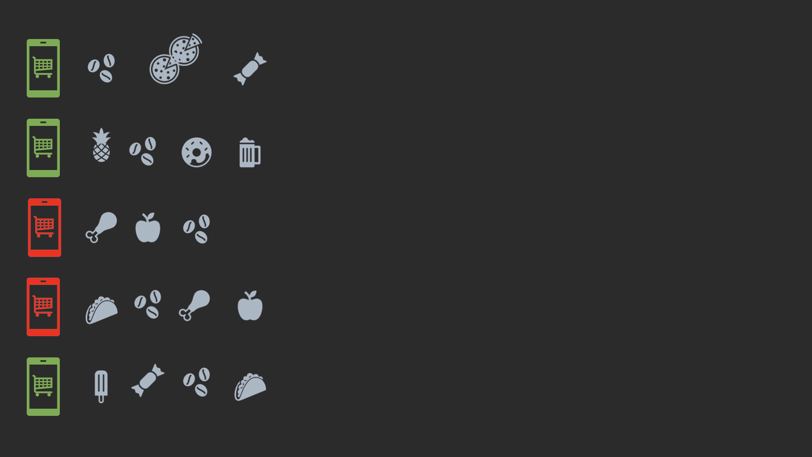

# Introduction to the domain

## Article

+ Article id (int)

+ Article name (string)

## Customer

+ Customer id (int)

+ Customer name (string)

+ Customer lastName (string)

## Order

+ Order id (int)

+ Customer id (int)

+ Order payment status (true/false)

+ OrderLine:
  
    An orderline represents a single sale of a particular product. It contains the following information:
    - **ArticleId**: The id of the article that was sold.
    - **Quantity**: The quantity of the article that was sold.
    - **Price**: The unit price of the article that was sold.

